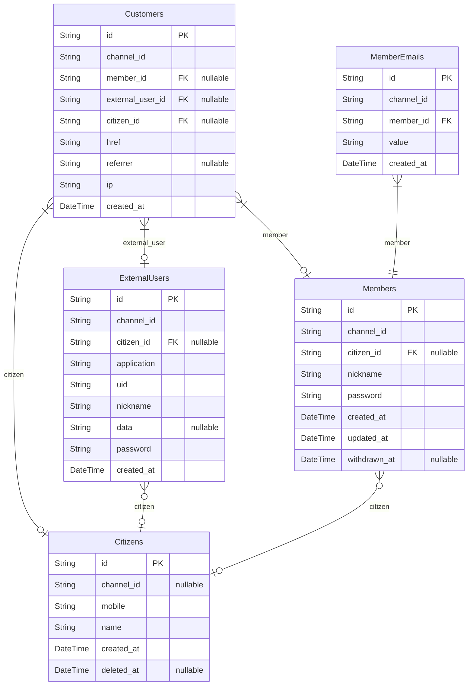
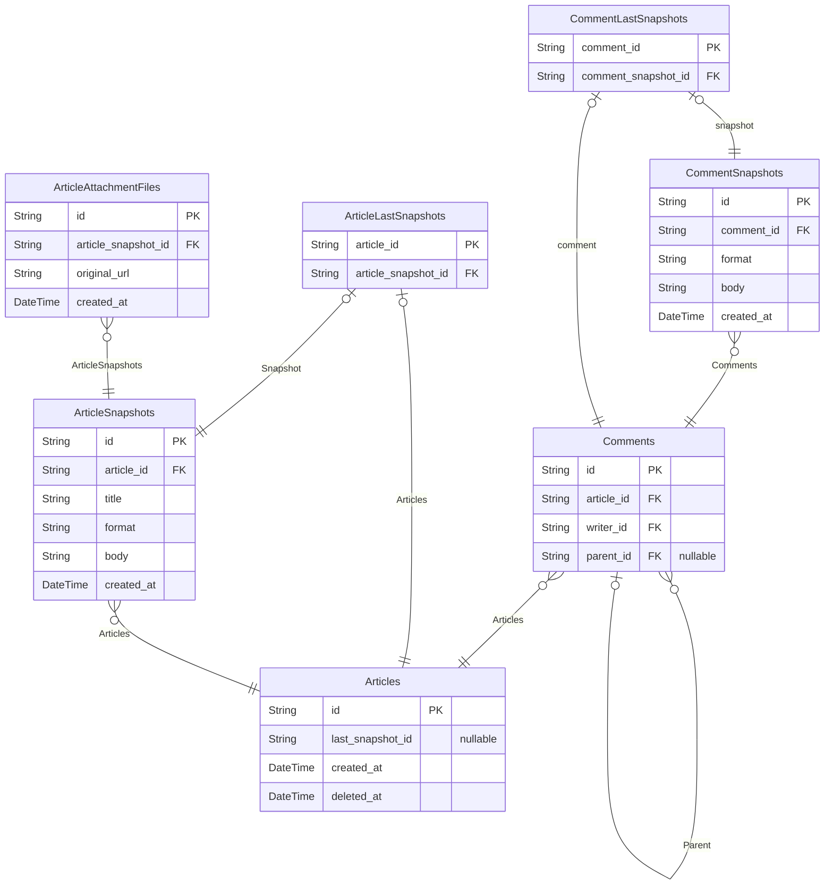
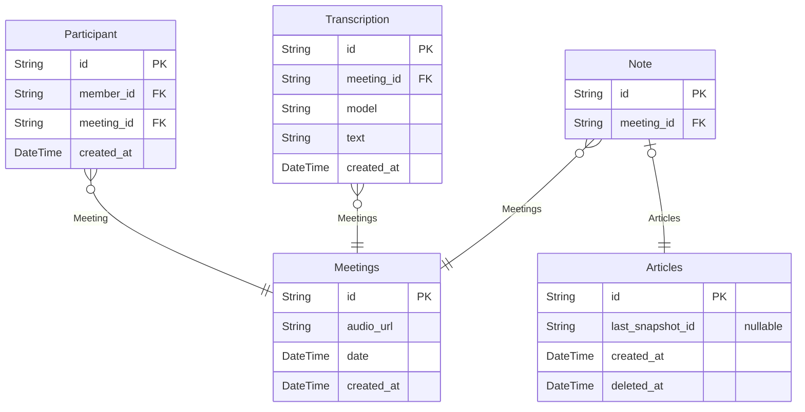

# Github
> Generated by [`prisma-markdown`](https://github.com/samchon/prisma-markdown)

- [Actors](#actors)
- [Articles](#articles)
- [Meetings](#meetings)

## Actors

### `Customers`
고객 정보, 단 개인이 아닌 **연결** 기반.

`Customers` 엔터티는 시스템에 고객으로 참여한 사용자의 연결 정보를 구체적으로 나타냅니다.
여기서 '고객'은 단순한 개인이 아니라 **연결(connection)**의 관점에서 본 것입니다.
따라서 동일한 사람이 여러 번 접속할 경우, `Customers`에 여러 레코드가 생성됩니다.

고객의 접속 경로와 관련 정보를 상세히 추적하며,
동일한 사용자가 비회원 상태로 접속한 후, 실명 인증이나 회원 가입/로그인을 진행할 때
관련 정보를 통합 관리할 수 있도록 설계되었습니다.

또한, 동일한 사용자가 외부 서비스, 여러 회원 계정, 실명 인증 등을 통해 접속하는 경우
각 상황에 맞는 정보를 개별 레코드로 관리합니다.

**Properties**
  - `id`: 기본 키.
  - `channel_id`: 속한 채널의 [channels.id](#channels)
  - `member_id`: 속한 회원의 [Members.id](#Members)
  - `external_user_id`: 속한 외부 서비스 사용자의 [ExternalUsers.id](#ExternalUsers)
  - `citizen_id`: 속한 시민의 [Citizens.id](#Citizens)
  - `href`
    > 연결 URL.
    > [window.location.href](#window)
  - `referrer`
    > Referrer URL.
    > [window.document.referrer](#window)
  - `ip`: IP 주소,
  - `created_at`
    > 레코드 생성 시간.
    > 사용자가 접속한 시각.

### `ExternalUsers`
외부 사용자 정보.

`ExternalUsers`는 시스템이 외부 서비스와 연동하여
외부 서비스 사용자를 관리할 때 사용하는 엔터티입니다.

외부 서비스로부터 접속한 사용자는 반드시 이 레코드를 가지며,
외부 사용자는 `application`과 `uid` 속성을 통해 식별됩니다.
만약 외부 사용자에 대해 추가 인증 절차가 진행되면,
관련 정보를 통합 관리할 수 있도록 설계되었습니다.

외부 서비스로부터 받은 추가 정보는 JSON 형식의 `data` 필드에 기록됩니다.

`password`는 외부 시스템에서 발급한 인증 토큰이며, 실제 사용자 비밀번호는 아닙니다.

**Properties**
  - `id`: 기본 키.
  - `channel_id`: 속한 채널의 [channels.id](#channels)
  - `citizen_id`: 속한 시민의 [Citizens.id](#Citizens)
  - `application`
    > 외부 서비스의 식별자 코드.
    > 보통 [channels.code](#channels)와 동일한 값을 가질 수 있음.
  - `uid`: 외부 시스템에서의 외부 사용자 식별 키.
  - `nickname`: 외부 시스템에서의 외부 사용자 닉네임.
  - `data`: 외부 시스템으로부터 받은 추가 정보.
  - `password`
    > 외부 시스템에서 발급한 인증 토큰.
    > 실제 사용자 비밀번호와는 다릅니다.
  - `created_at`
    > 레코드 생성 시간.
    > 사용자가 처음으로 접속한 시각.

### `Citizens`
시민 인증 정보.

`Citizens`는 사용자의 실명 및 휴대폰 정보를 기록하는 엔터티입니다.

한국의 경우 실명 인증이 중요한 요소지만, 해외에서는 휴대폰 번호를 통한 식별이 주가 됩니다.

실명과 휴대폰 인증 정보는 암호화되어 저장됩니다.

**Properties**
  - `id`: 기본 키.
  - `channel_id`
    > 속한 채널의 [channels.id](#channels)
    > 각 채널별로 개인 정보를 별도로 관리하며,
    > 동일한 시민이 다른 채널에서 인증될 수 있도록 합니다.
  - `mobile`: 휴대폰 번호.
  - `name`: 실명 또는 식별 가능한 이름.
  - `created_at`
    > 레코드 생성 시간.
    > 시민이 처음 활성화된 시각.
  - `deleted_at`: 레코드 삭제 시간.

### `Members`
회원 계정.

`Members`는 사용자가 시스템에 회원으로 가입할 때 생성되는 엔터티입니다.

또한, `Members`는 슈퍼타입 엔터티로서 여러 회원 하위 유형을 구성 및 관리할 수 있습니다.
단, 고객 연결 정보인 [Customers](#Customers)는 별도의 하위 유형으로 분리되지 않습니다.

동일한 시민이 여러 역할로 활동할 수 있도록 설계되었습니다.

**Properties**
  - `id`: 기본 키.
  - `channel_id`: 속한 채널의 [channels.id](#channels)
  - `citizen_id`: 속한 시민의 [Citizens.id](#Citizens)
  - `nickname`: 닉네임.
  - `password`: 로그인용 비밀번호.
  - `created_at`
    > 레코드 생성 시간.
    > 회원 가입 시각.
  - `updated_at`: 레코드 수정 시간.
  - `withdrawn_at`: 레코드 삭제(탈퇴) 시간.

### `MemberEmails`
회원의 이메일 주소.

하나의 회원에 대해 여러 개의 이메일 주소 등록을 허용합니다.
만약 단일 이메일 주소만 필요하다면, 해당 부분을 수정할 수 있습니다.

**Properties**
  - `id`: 
  - `channel_id`
    > 속한 채널의 [channels.id](#channels)
    > [Members.channel_id](#Members)와 중복되지만,
    > 유니크 제약 조건 구성을 위해 포함합니다.
  - `member_id`: 속한 회원의 [Members.id](#Members)
  - `value`: 이메일 주소.
  - `created_at`: 레코드 생성 시간.

## Articles

### `Articles`
게시글

모든 게시글의 원형으로서 게시글의 Base가 된다.
예컨대, 메모, 노트 등은 Article의 일종이다.
이런 경우 Article을 Base로 가지는 테이블이 될 것이며, 해당 테이블들은 Article의 ID를 가지기만 해도,
게시글과 같이 글을 작성하고 수정하는 모든 기능이 ERD 상 완성된 것으로 볼 수 있게 되는 것이다.

**Properties**
  - `id`: ID
  - `last_snapshot_id`
    > 마지막 스냅샷 아이디
    > 
    > 마지막 스냅샷으로 바로 갈 수 있도록 아이디를 하나 더 걸어둔다.
    > 의도된 반 정규화이다.
  - `created_at`: 데이터가 생성된 시간
  - `deleted_at`
    > 데이터가 삭제된 시간
    > 
    > 해당 시간이 비어있으면(NULL이면) 아직 삭제가 되지 않은 것이다.

### `Comments`
댓글

모든 댓글의 Base가 된다.
댓글은 칼럼만 두고 보았을 때는 [게시글](#Articles)과 거의 비슷한데, 이는 글을 쓴다는 목적이 같기 때문이다.
다만 개념 상 게시글에 달리는 짧은 글귀라는 점에서 차이가 있으므로 별도의 테이블로 관리함이 맞다.

**Properties**
  - `id`: 
  - `article_id`
    > [게시글](#Articles) 아이디 
    > 
    > [게시글](#Articles) 아이디로부터 게시글 스냅샷을 가고, 어떤 내용인지 추적할 수 있게 된다.
  - `writer_id`
    > 작성자의 아이디
    > 
    > 이 댓글을 작성한 사람의 아이디를 의미한다.
  - `parent_id`
    > 부모 댓글의 아이디
    > 
    > 부모인 댓글이 있는 경우를 의미한다.
    > 이후 계층 구조를 확장할 가능성을 대비하여 미리 생성하는 칼럼이다.

### `CommentSnapshots`
///{link Comments 댓글} 스냅샷

댓글의 변경 내역을 관리하기 위해 만들어진 스냅샷이다.

**Properties**
  - `id`: ID
  - `comment_id`: [댓글](#Comments)의 아이디
  - `format`: 스냅샷 포맷 (예: md, html, text 중 하나)
  - `body`: 본문 내용
  - `created_at`
    > 데이터가 생성된 시간
    > 
    > 댓글의 수정 시각과 동일하며, 이 시간이 가장 마지막인 스냅샷이 현재 댓글의 내용으로 사용자에게 표시된다.

### `ArticleLastSnapshots`
게시글의 마지막 스냅샷

성능 이슈를 해결하기 위해 마지막 스냅샷에 대한 참조를 별도로 둔다.
이 테이블을 이용하면 전체 스냅샷을 조회할 필요 없이 항상 마지막 스냅샷을 찾을 수 있다.
모든 게시글은 반드시 스냅샷을 가지므로, 논리적으로 이 테이블의 row가 존재해야 한다.

**Properties**
  - `article_id`
    > [게시글](#Articles)의 아이디
    > 
    > 게시글의 아이디를 FK이자 PK로 사용하여, 게시글마다 1개의 row만 존재하도록 명시한다.
  - `article_snapshot_id`
    > [ArticleSnapshots](#ArticleSnapshots)의 아이디
    > 
    > 스냅샷의 아이디로 유니크 제약이 걸려 단 1개만 존재할 수 있다.

### `ArticleSnapshots`
게시글 스냅샷 목록

**Properties**
  - `id`: ID
  - `article_id`: [게시글](#Articles)의 아이디
  - `title`: 제목
  - `format`: 스냅샷 포맷 (예: md, html, text 중 하나)
  - `body`: 본문 내용 
  - `created_at`
    > 데이터가 생성된 시간
    > 
    > 게시글 수정 시각과 동일하며, 마지막 스냅샷이 현재 게시글의 내용으로 사용자에게 표시된다.

### `ArticleAttachmentFiles`
게시글 첨부 파일

게시글에 첨부된 파일을 의미하며, 파일 변경 시 스냅샷이 생성되어야 한다.
파일의 변동 없이 스냅샷만 변경될 경우, 파일 정보는 그대로 다음 스냅샷으로 이어진다.

**Properties**
  - `id`: ID
  - `article_snapshot_id`: 연결된 스냅샷의 아이디
  - `original_url`: 파일의 URI
  - `created_at`: 

### `CommentLastSnapshots`
댓글의 마지막 스냅샷

성능 상의 이유로, 댓글의 마지막 스냅샷을 별도로 참조하여 전체 스냅샷 목록을 조회하지 않고도 최신 상태를 빠르게 확인할 수 있다.
모든 댓글은 반드시 스냅샷을 가지므로, 각 댓글마다 이 모델에 해당하는 row가 존재해야 한다.

**Properties**
  - `comment_id`: 댓글의 아이디를 FK이자 PK로 사용하여, 각 댓글마다 단 하나의 row만 존재하도록 명시한다.
  - `comment_snapshot_id`
    > 마지막 스냅샷의 아이디.
    > 각 댓글은 반드시 하나의 마지막 스냅샷을 가지므로, 이 필드는 유니크 제약 조건을 가진다.

## Meetings

### `Meetings`
미팅/음성 메모 정보

사용자가 녹음한 미팅 또는 음성 메모의 원본 데이터를 저장하는 테이블입니다.
파일을 저장했다고 해도 무방하지만, 파일과 더불어 참석자나 미팅 시간 등 메타데이터 역할 수행합니다.
이 서비스에서는, 하나의 음성 파일에 대해 1개 이상의 노트를 생성할 수 있다고 가정합니다.

**Properties**
  - `id`: 기본 키.
  - `audio_url`: 미팅 녹음 파일의 URL.
  - `date`
    > 미팅 시간
    > 
    > 미팅 생성 시간과 미팅 시간은 다를 수 있다.
    > 미팅 생성은 오늘이지만, 과거의 음성 파일을 업로드하였을 수도 있기 때문이다.
    > 기능 자체가 확장될 경우를 대비하여, 미팅 날짜를 생성 시간과 따로, 유저에게 받도록 한다.
  - `created_at`: 미팅 생성 시각.

### `Participant`

**Properties**
  - `id`: 기본 키.
  - `member_id`: 
  - `meeting_id`: 
  - `created_at`: 

### `Transcription`
자막

음성 파일의 URL, 전사 텍스트를 관리합니다.
여기에는 예를 들어, Openai wisper 같이 특정 모델의 이름을 기록해둡니다.
모델마다 한국어 퀄리티가 다르기 때문에, 모델의 이름과 텍스트를 함께 저장함으로써,
추후 더 많은 텍스트들을 비교 분석하여 더 나은 모델을 고르거나, 또는 2개 이상의 모델을 활용하여
서비스 퀄리티 개선에 사용해야 합니다.

**Properties**
  - `id`: 기본 키.
  - `meeting_id`: 미팅
  - `model`: 모델 이름
  - `text`: 전체 텍스트
  - `created_at`: 자막 생성 시간.

### `Note`
미팅 기록, 노트

미팅 기록을 노트라고 부르는데, 여기서는 이것이 여러 개 일수도 있다는 전제로 ERD를 작성하였습니다.
이는, 하나의 음성 메모에 여러 개의 각기 다른 버전의 게시글을 작성할 수도 있을 거라는 예상 때문입니다.
벤치마킹하고 있는 서비스가, 실제로 어떤 기능이 더 추가될지 모르는 상황에서는 1:N 관계로 함이 마땅합니다.

노트는 게시글을 base로 하기 때문에,
ERD 설계 상으로는 노트에 연결된 게시글이 없을 수도 있지만 (1:0 or 1)
논리적으로 노트는 반드시 게시글을 가져와 생성되어야 하기 때문에 반드시 존재하게 되어 있습ㄴ디ㅏ.

**Properties**
  - `id`: 기본 키.
  - `meeting_id`
    > 미팅의 아이디
    > 
    > 어떤 미팅에 대한 노트인지를 가리키기 위해 아이디 값을 저장합니다.